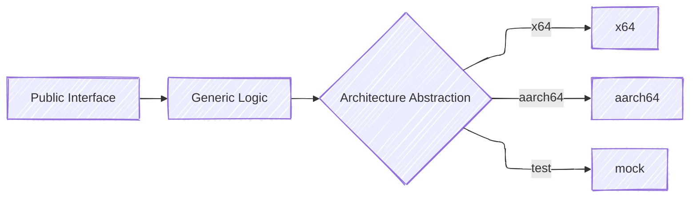
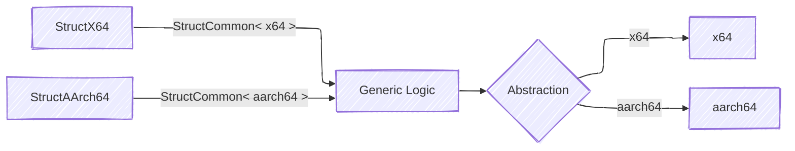

# Architecture Abstractions

Core modules in Patina often require divergent implementations for CPU architecture specific mechanisms. This may
be because the implementation requires assembly which cannot be compiled against other architectures, the implementation
is only applicable to a given architecture, or both. In these cases, developers are encouraged to ensure that as much
common code exists as possible. At the point of architecture abstraction, [trait abstraction principles](abstractions.md)
should be used to define the common contract with the architecture specific logic. This same abstraction can then
be used for testing of the common logic above/below the abstraction. While there is no one-size-fits-all structure to
how this should be done, this page describes some simple and common models that should be applied to handling such
abstractions.

## Code Structure

Implementations should avoid inlining architecture specific code into common logic as this creates code that is difficult
to read, difficult to test, and is prone to inconsistent contracts between architectures. Architecture specific logic
should be contained to explicit modules, such as `x64` or `aarch64`. The Patina crate provides macros that can be used
to add conditional compilation in a consistent way. If the logic is not compilable on other architectures, the module
should be conditionally compiled for that architecture.

```rust
#[cfg(target_arch = "x86_64")]
mod x64 {
    // A x64 specific module, intended only for platform builds.
}

#[cfg(target_arch = "aarch64")]
mod aarch64 {
    // A x64 specific module, intended only for platform builds.
}
```

It should be noted that using just the architecture does cause some inconsistencies around compilation. In particular
this will allow test compilation, but these tests may not actually be compiled/run since this requires that the
architecture matches the host system.

### Testing & Documenting

In many cases, the code in the architecture abstractions doesn't contain meaningful logic and merely wraps assembly to
invoke some CPU functionality not available through rust code. In these cases, there is little to no value in compiling
for tests as the contained code cannot be tested in usermode or cross architecture or for documentation (as the abstraction
trait should be documented if applicable).

However, when exposing more robust functional logic that is not entirely architecture abstraction it is
preferable that this logic be compiled under test and documentation. An example of this could be architecture
specific devices, which are only applicable to a given architecture but should be documented and has complex logic that
should be tested regardless of the architecture of the test compilation. The `test` and `doc` configuration can be
added alongside the target architecture. When using this style, it will be necessary for architecture logic to
be wrapped in test conditionals to avoid breaking host based tests.

```rust
#[cfg(any(target_arch = "aarch64", test, doc))]
pub mod aarch64_device {
    /// Robust public device structure for AArch64 devices with tests and documentation.
    pub struct Aarch64Device {
        base_address: usize,
    }

    impl Aarch64Device {
        fn set_registers() {
            #[cfg(all(not(test), not(doc)))]
            asm!("brk #0"); // Should only be compiled for platform builds
        }
    }
}
```

In rare cases where the code itself cannot be compiled for host targets, the check `target_os = "uefi"` can be used. This
should be avoided though as it prevents check, test, doc, or any other non-platform build compilation.

### Architecture Containment & Rust Analyzer

Rust Analyzer will not always show the status of all architectures when containing code using `target_arch = ".."`
configurations. The active architecture can be controlled using the `rust-analyzer.cargo.target` setting in VS Code.
The below settings should be used in the user settings to see the various architectures. Note, only one may be active at
a time.

- `"rust-analyzer.cargo.target": "aarch64-unknown-uefi"`
- `"rust-analyzer.cargo.target": "x86_64-unknown-uefi"`

## Trait Abstraction Example

A common case for architecture abstraction is an interface in which almost all of the code is architecture agnostic, but
there exists some low-level architecture specific details.



Above the point of abstractions, generics can be used to allow for testing while maintaining a clean external
interface. Below is a simplified example of such an abstraction for a interface to reboot the system.

```rust
/// Public interface that is architecture agnostic.
pub trait SystemReboot {
    fn reboot(&self);
}

/// Struct that handles architecture common code.
struct SystemRebootManager<T: SystemRebootArch> {
    arch: T,
}

/// Trait that defines the architecture abstraction.
trait SystemRebootArch {
    fn arch_reboot(&self);
}

impl<T: SystemRebootArch> SystemReboot for SystemRebootManager<T> {
    fn reboot(&self) {
        // Arch common logic. E.g.
        // - Notify callbacks of reboot
        // - Set reboot reason
        // - etc.

        self.arch.arch_reboot();
    }
}
```

The architectures should then be implemented in submodules specific to the architecture. These should normally be named
x64, aarch64, etc. to ensure consistent structure. Normally these would be separate files, but are inlined for the
sake of this example. The architectures may be wrapped in architecture checks. See the [testing & documenting](#testing--documenting)
for more details on the specific checks to use.

```rust
mod common {
    trait SystemRebootArch {
        fn arch_reboot(&self);
    }

    #[cfg(target_arch = "x86_64")]
    mod x64 {
        struct SystemRebootX64;
        impl super::SystemRebootArch for SystemRebootX64 {
            fn arch_reboot(&self) {
                // x86_64 reset assembly.
            }
        }
    }

    #[cfg(target_arch = "aarch64")]
    mod aarch64 {
        struct SystemRebootAArch64;
        impl super::SystemRebootArch for SystemRebootAArch64 {
            fn arch_reboot(&self) {
                // aarch64 reset assembly.
            }
        }
    }
}
```

While it seems excessive for this simple scenario, this creates an abstraction that clearly defines architecture specifics,
allows for unit and integration testing, and optimizes builds to only compile code relevant to the current architecture.
An alternative to this may be to inline the architecture specifics into the common code, with cfg checks for
architecture. However, this leads to code that will only increase in complexity with new architectures, potentially
divergent expectations between blocks, and code that is difficult to test due to the inlined hardware logic.

How far up the implementation stack the generic goes before being abstracted away is up to the developer and depends on
the complexity of the structures, desire for unit vs integration testing, and maintainability.

## Using Default Generics

The above trait abstraction is powerful, though when integrating into a system, we do not want the callers to have
to carry that generic all the way up the stack. The trait defaults can be very useful in allowing for generics for
extensibility and testing, but hiding that from callers.

```rust
mod common {
    pub struct ArchNamer<T = CompiledArch> {
        arch: core::marker::PhantomData<T>,
    }

    impl<T: ArchName> ArchNamer<T> {
        pub fn get_name(&self) -> &'static str {
            T::name()
        }
    }
    pub trait ArchName {
        fn name() -> &'static str;
    }

    #[cfg(target_arch = "x86_64")]
    type CompiledArch = x64::ArchNameX64;
    #[cfg(target_arch = "aarch64")]
    type CompiledArch = aarch64::ArchNameAArch64;

    mod x64 {
        pub struct ArchNameX64;
        impl super::ArchName for ArchNameX64 {
            fn name() -> &'static str {
                "x86_64"
            }
        }
    }

    mod aarch64 {
        pub struct ArchNameAArch64;
        impl super::ArchName for ArchNameAArch64 {
            fn name() -> &'static str {
                "aarch64"
            }
        }
    }
}
```

This allows callers to simply use `ArchNamer` without having to specify the architecture, but allows for more robust
testing of interfaces that may leverage `ArchNamer`.

## Extending This Model

This model of using trait abstraction for architectures can easily be extended to more complex scenarios. For example,
it may be desirable to have a different exposed structure for each architecture but use common code internally. In such
a model code reuse can be done through leveraging generics.


